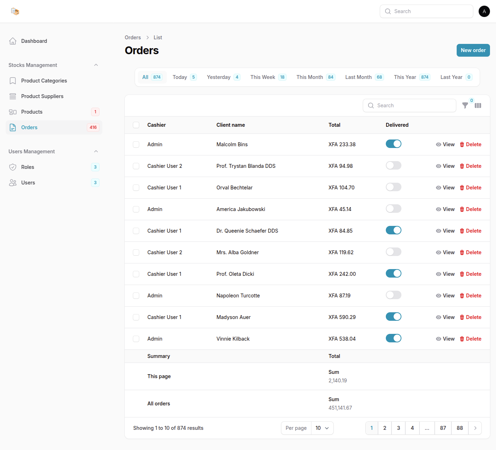

# 📦 Stocks Management System 

**Stockx** adalah solusi manajemen inventaris yang kuat dan intuitif yang dibangun menggunakan Laravel dan FilamentPHP, dirancang untuk menyederhanakan pengelolaan stok, pesanan, pemasok, dan peran pengguna — semuanya dalam satu sistem terintegrasi.

Baik Anda mengelola gudang, bisnis kecil, maupun operasi skala besar, StockX menyediakan semua alat yang Anda butuhkan untuk menjaga inventaris tetap tertata dan terkendali.

📑 Manajemen Pemesanan

Penanganan Pesanan – Buat dan kelola pesanan dengan validasi stok otomatis dan pembaruan inventaris secara dinamis.

Validasi Stok – Memastikan ketersediaan produk saat proses pemesanan.

Peringatan Stok Menipis – Notifikasi email otomatis ketika stok berada di bawah ambang batas.


---

👥 Manajemen Pengguna & Peran

Admin Pengguna – Buat, edit, dan kelola akun pengguna lengkap dengan penugasan peran.

Kontrol Akses Berbasis Peran (RBAC) – Pengaturan izin akses yang rinci menggunakan Filament Shield.


---

🔔 Notifikasi

Email Stok Rendah – Notifikasi otomatis kepada admin saat stok barang menipis.


---

📊 Dashboard & Analitik

Grafik Interaktif – Visualisasi tren penjualan dan stok barang.

Statistik Cepat – Informasi singkat seperti total pengguna, produk, pesanan, dan peringatan.


---

🧭 Pencarian Global

Pencarian Pintar – Cari produk, pesanan, dan pemasok dengan hasil yang lengkap dan informatif.

Navigasi Cepat – Langsung menuju halaman item dari hasil pencarian.


---

🔍 Filter & Tab

Filter Pesanan – Saring data berdasarkan waktu khusus seperti hari ini, minggu ini, atau tahun ini.

Tab Pemasok – Kelompokkan pemasok berdasarkan kategori produk.


---

🔐 Autentikasi & Keamanan

Login Aman – Sistem autentikasi lengkap dengan verifikasi email.

Sistem Izin – Batasi akses fitur berdasarkan peran pengguna untuk keamanan maksimal.


## 🖼️ Screenshots

Here’s a quick peek at what StockX looks like in action:

- **Dashboard**  
  .png)
  .png)

- **Products**  
  .png)
  .png)

- **Orders**  
  .png)
  

- **Create Order**  
  .png)

- **Roles**  
  .png)

- **Edit Role**  
  .png)

- **Email Notification (Low Stock)**  
  


## ⚙️ Deployment Guide

### 📋 Prerequisites

You only need **Docker** and **Docker Compose** installed on your system. All other dependencies (PHP, Composer, Node.js, MySQL, etc.) are handled inside containers.

- **Docker** ≥ 20.10
- **Docker Compose** ≥ 1.29

> If you prefer manual installation, see the [Manual Setup](#manual-setup) section below.

### 🐳 Docker Deployment (Recommended)

#### 1. Clone the Repository
```bash
git clone https://github.com/abogo-nono/StocksX.git
cd StocksX
```

#### 2. Copy and Configure Environment Variables
```bash
cp .env.example .env
# Edit .env as needed (DB, mail, etc.)
```

#### 3. Build and Start the Containers
```bash
docker-compose up --build -d
```

- This will build the app container, set up MySQL, and run all necessary services.
- All dependencies are installed automatically inside the containers.

#### 4. Run Migrations, Seeders, and Setup Commands
```bash
docker-compose exec app php artisan migrate --seed
docker-compose exec app php artisan storage:link
docker-compose exec app php artisan make:filament-user
docker-compose exec app php artisan shield:install --fresh
docker-compose exec app php artisan shield:generate --all
docker-compose exec app php artisan shield:super-admin --user=1
```

#### 5. Access the Application
- Visit [http://localhost:9000](http://localhost:9000) (or the port you mapped)

---

### 🛠️ Manual Setup (For Development/Advanced Users)

If you want to run the app without Docker, follow these steps:

#### Prerequisites
- **PHP** ≥ 8.2  
- **Composer** ≥ 2.3  
- **Node.js** ≥ 18.8  
- **NPM** ≥ 8.18  
- **MySQL** ≥ 8.0  
- **Mailpit** – For testing email notifications  

#### Installation Steps

1. Install dependencies:
```bash
composer install
npm install
```
2. Build frontend assets:
```bash
npm run build
```
3. Set up `.env` and database as described above.
4. Run migrations, seeders, and setup commands as above.
5. Start the Laravel server:
```bash
php artisan serve
```
6. (Optional) Start Vite dev server for hot reload:
```bash
npm run dev
```
